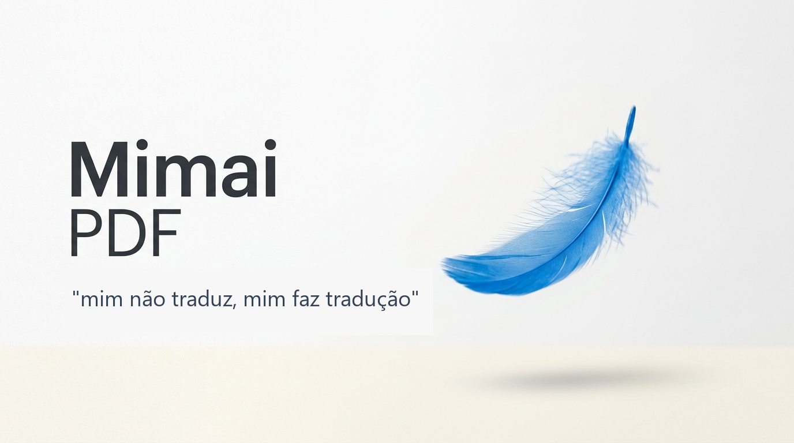
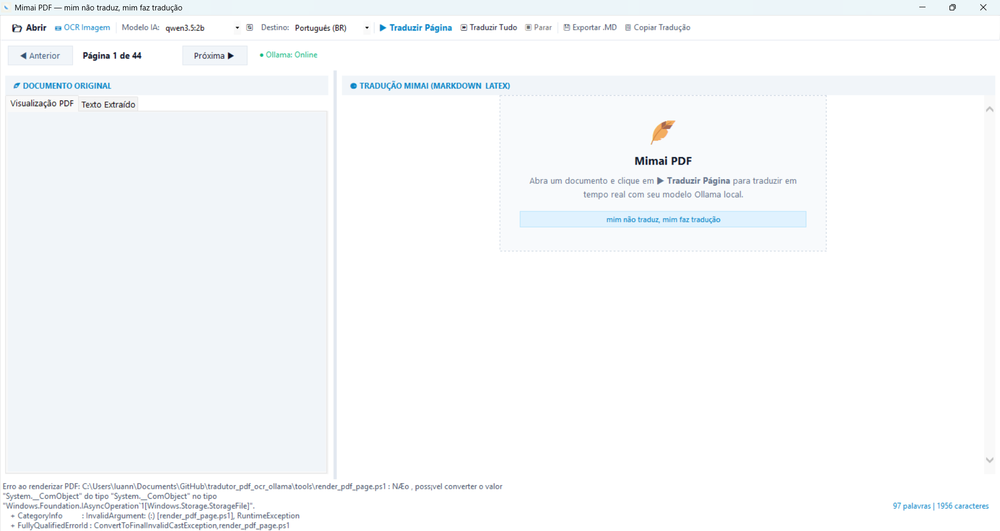

<p align="center">
  
</p>

<h1 align="center">Mimai PDF</h1>

<p align="center"><em>“mim não traduz, mim faz tradução”</em></p>

Aplicação desktop nativa para Windows 11 que abre, visualiza, reconhece e traduz documentos localmente usando C#, WinForms, APIs nativas do Windows e Ollama.

## Propósito

O Mimai PDF foi criado para facilitar a leitura de artigos matemáticos. A ideia central é permitir que fórmulas, símbolos, seções e explicações técnicas permaneçam organizados enquanto o conteúdo é traduzido e corrigido localmente. O projeto nasceu de uma necessidade prática de estudar artigos em outros idiomas com mais clareza, sem depender de serviços de tradução na nuvem.

## Escopo atual

- Leitura de PDF, TXT e Markdown.
- Extração de texto sob demanda, apenas da página a traduzir, com PdfPig incorporado.
- Visualização real de PDF com `Windows.Data.Pdf`.
- OCR local para imagens e páginas escaneadas com `Windows.Media.Ocr`.
- Dois modos de tradução: texto extraído corrigido pelo modelo ou OCR por visão enviando a imagem da página ao modelo.
- Tradução por streaming através do Ollama local.
- Fórmulas LaTeX renderizadas localmente como imagens, sem scripts remotos, com WpfMath incorporado ao executável.
- Cache persistente por documento, página, idioma e modelo.
- Navegação página a página e tradução em lote.
- Exportação em Markdown e cópia da tradução.
- Terceira coluna com chat sobre a página atual, edição da tradução por IA e opção de desfazer.

O projeto é Windows-only e não depende de Node.js, Python, Rust, Electron ou Tauri. A compilação usa o `csc.exe` do .NET Framework instalado no Windows.

## Demonstração



O screenshot mostra a interface desktop com navegação por páginas, visualização original, painel de tradução e conexão com Ollama.

## Arquitetura

```text
Program.cs
    └── MainForm.cs                 interface e coordenação do fluxo
        ├── PdfExtractor.cs         extração de texto e páginas
        ├── render_pdf_page.ps1     renderização via Windows.Data.Pdf
        ├── ocr_windows.ps1         OCR via Windows.Media.Ocr
        ├── OllamaClient.cs         HTTP e streaming em /api/generate
        └── TranslationCache.cs     cache em %APPDATA%
```

O formulário coordena o fluxo atual. A separação dos componentes deixa a extração, renderização, OCR, tradução e persistência substituíveis sem alterar a janela inteira. As decisões arquiteturais estão registradas em [`docs/adr/`](docs/adr/README.md).

## Estrutura

```text
src/
  Program.cs
  MainForm.cs
  PdfExtractor.cs
  OllamaClient.cs
  TranslationCache.cs
tools/
  render_pdf_page.ps1
  ocr_windows.ps1
docs/adr/
tests/
build.bat
build.ps1
run.bat
mimai_pdf.exe
```

## Requisitos

- Windows 10/11 com suporte às APIs `Windows.Data.Pdf` e `Windows.Media.Ocr`.
- .NET Framework 4.x com `csc.exe` para compilar.
- .NET Framework 4.7.1 ou superior com WPF para renderizar fórmulas e extrair páginas PDF.
- Ollama instalado e em execução em `http://localhost:11434` para traduzir.
- Um modelo Ollama, por exemplo `qwen2.5:7b`.

## Compilar e executar

Pelo terminal:

```powershell
.\build.ps1
.\mimai_pdf.exe
```

Ou execute `build.bat` e depois `run.bat`. O executável gerado é `mimai_pdf.exe`.

## Download

A versão pública para Windows está disponível na [release v1.0.0](https://github.com/lu4nn3ry/mimai_pdf/releases/tag/v1.0.0). O download direto é [mimai_pdf.exe](https://github.com/lu4nn3ry/mimai_pdf/releases/download/v1.0.0/mimai_pdf.exe).

Para preparar o Ollama:

```powershell
ollama run qwen2.5:7b
```

Depois abra um PDF pelo botão, arraste o arquivo para a janela ou use `Ctrl+O`.

## Fluxo de processamento

1. O PDF é aberto para carregar sua estrutura e contagem de páginas, sem extrair texto.
2. Os registros das páginas ficam sem texto até serem solicitados. TXT/Markdown são carregados diretamente.
3. A página atual é renderizada como imagem pelo `render_pdf_page.ps1`.
4. O usuário escolhe entre “Texto extraído (manual)” ou “OCR com IA Vision”.
5. Ao traduzir no modo manual, só o texto da página selecionada é extraído (ou reutilizado) e enviado ao modelo; no modo Vision, apenas a imagem é enviada, sem extração textual.
6. O resultado é recebido do Ollama em streaming.
7. A tradução é exibida e salva no cache.
8. O documento traduzido pode ser exportado para Markdown.

## Limitações conhecidas

O chat usa o modelo selecionado e o conteúdo da página atual. Escreva sua dúvida
e clique em **Enviar** (ou `Ctrl+Enter`). Para alterar o texto, selecione
**Editar a tradução** antes de enviar a instrução. A revisão é salva no cache;
**Desfazer** recupera a versão anterior. A conversa é reiniciada ao mudar o contexto.

- O renderizador matemático não implementa todo o LaTeX; comandos não suportados continuam visíveis como texto. Copiar e exportar preservam o LaTeX original.

- A reconstrução do texto da página pode perder ordem em PDFs com múltiplas colunas, tabelas ou fontes incomuns.
- O cache atual usa o nome do arquivo como parte da chave; alterações no conteúdo mantendo o mesmo nome podem exigir limpeza manual do cache.
- O OCR é acionado manualmente pela interface e ainda não é automático para toda página sem texto.
- O `MainForm` ainda concentra parte da coordenação do fluxo; a evolução prevista está em [`TODO.md`](TODO.md).

## ADRs

- [0001 — Arquitetura nativa Windows/C#](docs/adr/0001-arquitetura-nativa-windows-csharp.md)
- [0002 — Remoção do protótipo web](docs/adr/0002-remocao-prototipo-web.md)
- [0003 — Identidade visual Mimai PDF](docs/adr/0003-identidade-visual-mimai-pdf.md)
- [0004 — Modernização da UX/UI](docs/adr/0004-modernizacao-ux-ui-pantone-2026.md)

## Licença

Este projeto é distribuído sob a [licença MIT](LICENSE).
